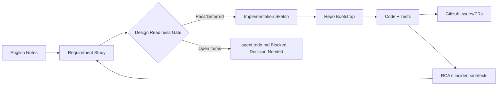

# polyagent-skills

**Write AI agent skills once, use everywhere — portable skill library for Claude Code, Kiro, Codex, Gemini, OpenClaw, Cursor & more.**

[](LICENSE)

---

## The Problem

Every AI coding agent has its own way of consuming instructions — `CLAUDE.md`, `AGENTS.md`, `.kiro/specs/`, `.cursor/rules.md`. Writing skills for one means rewriting for another. That's unsustainable when you're switching agents across machines, teams, or tasks.

## The Solution

**polyagent-skills** is a spec-driven, agent-agnostic skill library. Skills are written once in portable Markdown and consumed by any agent through thin adapter files.

```
┌──────────────────────────────────────────────────┐
│  Layer 3: Adapters        (thin, per-agent)       │
│  CLAUDE.md / AGENTS.md / .kiro/ / .gemini/        │
├──────────────────────────────────────────────────┤
│  Layer 2: Skill Library   (portable, markdown)    │
│  skills/requirement-study/  skills/deck-creator/  │
├──────────────────────────────────────────────────┤
│  Layer 1: Common Foundation (shared patterns)     │
│  common-skills/  templates/  conventions          │
└──────────────────────────────────────────────────┘
```

## Supported Agents

| Agent | Adapter File | Status |
|-------|-------------|--------|
| Claude Code | `CLAUDE.md` | ✅ Supported |
| OpenAI Codex | `AGENTS.md` | ✅ Supported |
| AWS Kiro | `.kiro/specs/` | ✅ Supported |
| Google Gemini | `.gemini/instructions.md` | ✅ Supported |
| OpenClaw | `~/.openclaw/skills/` | ✅ Supported |
| Cursor | `.cursor/rules.md` | ✅ Supported |
| Windsurf | `.windsurfrules` | 🟡 Planned |

## Quick Start

```bash
# Clone the repo
git clone https://github.com/gyanranjan/polyagent-skills.git
cd polyagent-skills

# One-time global install (Codex + Kiro + Gemini + OpenClaw)
./scripts/install-global-all.sh copy

# Project install (kept for per-repo adapters)
./scripts/install-to-project.sh /path/to/my-project all

# Or install for a specific agent only
./scripts/install-to-project.sh /path/to/my-project claude-code
```

Use global install when you want "set once, reuse everywhere." Use project install when you want repo-local agent config files.

Preferred unified CLI:

```bash
# One command surface for checks/install/export
./scripts/polyagentctl.py check
./scripts/polyagentctl.py install-global copy
./scripts/polyagentctl.py export-pdf docs/spec.md docs/spec.pdf
./scripts/polyagentctl.py self-install
```

## Spec-Driven Delivery Flow



Key controls before coding:
- Requirements traced as `REQ-*` / `NFR-*`
- Architecture pattern, language/runtime, DB strategy, and logging baseline decided
- Open design items explicitly blocked in `agent.todo.md`

## Install Modes

### Global (one-time)

```bash
./scripts/install-global-all.sh copy
```

This installs:

- Shared global library: `~/.polyagent-skills/skills` and `~/.polyagent-skills/common-skills`
- Global Codex instructions: `~/.codex/AGENTS.md`
- Global Kiro instructions: `~/.kiro/specs/polyagent-skills.md`
- Global Gemini instructions: `~/.gemini/instructions.md`
- OpenClaw managed skills: `~/.openclaw/skills` and `~/.openclaw/common-skills`

Optional dev mode:

```bash
./scripts/install-global-all.sh link
```

`link` symlinks the shared library for live edits; OpenClaw still receives normalized copied skills for parser compatibility.

### Uninstall global setup (safe)

```bash
# Preview what would be removed
./scripts/uninstall-global-all.sh --dry-run

# Remove only installer-managed paths
./scripts/uninstall-global-all.sh
```

Uninstall removes only paths recorded in installer manifest files and only when ownership markers match.

### Per-project (existing behavior)

```bash
./scripts/install-to-project.sh /path/to/my-project all
```

This copies adapters plus `skills/` and `common-skills/` into that specific project.

## Available Skills

| Skill | Purpose | Status |
|-------|---------|--------|
| [idea-to-mvp](skills/idea-to-mvp/) | Turn a rough idea into a validated MVP plan | ✅ Active |
| [requirement-study](skills/requirement-study/) | Analyze, write, and validate requirements | ✅ Active |
| [implementation-sketch](skills/implementation-sketch/) | Create implementation plans from specs | ✅ Active |
| [mail-summarizer](skills/mail-summarizer/) | Summarize and draft replies to emails | ✅ Active |
| [document-analyzer](skills/document-analyzer/) | Understand and extract insights from documents | ✅ Active |
| [deck-creator](skills/deck-creator/) | Create presentations from content | ✅ Active |
| [repo-bootstrap](skills/repo-bootstrap/) | Scaffold new repositories with best practices | ✅ Active |
| [agent-writer](skills/agent-writer/) | Write new agent definitions | ✅ Active |
| [desensitizer](skills/desensitizer/) | Data desensitization and anonymization | ✅ Active |
| [remote-ops](skills/remote-ops/) | Remote operations and infra management | ✅ Active |
| [expert-research](skills/expert-research/) | Deep expert analysis and recommendation support | ✅ Active |

## Repo Structure

```
polyagent-skills/
├── README.md
├── LICENSE
├── CONTRIBUTING.md
├── KNOWN_ISSUES.md
├── agent.todo.md             # Canonical cross-session, multi-agent TODO ledger
│
├── docs/
│   ├── specs/                 # Spec-driven development
│   │   ├── SPEC_TEMPLATE.md
│   │   ├── skill-format-spec.md
│   │   └── adapter-contract-spec.md
│   ├── adrs/                  # Architecture Decision Records
│   │   ├── ADR_TEMPLATE.md
│   │   ├── 001-markdown-as-skill-format.md
│   │   ├── 002-three-layer-architecture.md
│   │   ├── 003-adapter-pattern.md
│   │   ├── 004-mcp-for-tool-skills.md
│   │   └── 005-workflow-orchestration-and-session-todo.md
│   ├── rca/                   # Root Cause Analysis templates and docs
│   │   └── RCA_TEMPLATE.md
│   └── rfcs/                  # Proposals for significant changes
│       └── RFC_TEMPLATE.md
│
├── common-skills/             # Shared building blocks
│   ├── README.md
│   ├── agent-todo-ledger.md
│   ├── design-readiness-gate.md
│   ├── document-tail-sections.md
│   ├── output-formatting.md
│   ├── quality-checklist.md
│   └── mermaid-to-pdf.md
│
├── skills/                    # Portable skill library
│   ├── idea-to-mvp/
│   ├── requirement-study/
│   ├── implementation-sketch/
│   ├── mail-summarizer/
│   ├── document-analyzer/
│   ├── deck-creator/
│   ├── repo-bootstrap/
│   ├── agent-writer/
│   ├── desensitizer/
│   ├── remote-ops/
│   └── expert-research/
│
├── adapters/                  # Thin agent-specific wrappers
│   ├── claude-code/
│   ├── codex/
│   ├── kiro/
│   ├── gemini/
│   └── cursor/
│
├── mcp-servers/               # MCP servers for tool-based skills
│
├── scripts/                   # Automation
│   ├── install-global-all.sh
│   ├── install-openclaw-global.sh
│   ├── uninstall-global-all.sh
│   ├── install-to-project.sh
│   ├── check-mermaid.sh
│   ├── design-readiness-check.sh
│   ├── init-requirement-issues.sh
│   ├── sync-agent-todo.sh
│   ├── sync-adapters.sh
│   ├── pull-skill.sh
│   ├── md-to-pdf.sh
│   ├── md-to-pdf-renderer.py
│   └── polyagentctl.py
│
├── agent-notes/               # Cross-cutting agent observations
│
└── .github/
    ├── ISSUE_TEMPLATE/
    └── workflows/
```

## Design Principles

1. **Skills are knowledge, not code** — Written in Markdown, readable by any LLM
2. **Adapters are thin** — Never put skill logic in an adapter; only pointers
3. **Spec-driven** — Every skill follows the [Skill Format Spec](docs/specs/skill-format-spec.md)
4. **Decisions are recorded** — All architecture choices have an [ADR](docs/adrs/)
5. **Common patterns are shared** — DRY via `common-skills/`
6. **MCP for tools** — When skills need capabilities (not just instructions), use MCP

## Documentation

- [Skill Format Spec](docs/specs/skill-format-spec.md) — How to write a portable skill
- [Adapter Contract Spec](docs/specs/adapter-contract-spec.md) — How adapters work
- [Architecture Decision Records](docs/adrs/) — Why we made the choices we did
- [RCA Template](docs/rca/RCA_TEMPLATE.md) — Root cause analysis format for incidents/defects
- [Known Issues](KNOWN_ISSUES.md) — Current limitations and workarounds
- [Contributing Guide](CONTRIBUTING.md) — How to add skills and adapters

## Workflow Automation Scripts

```bash
# Mermaid tooling check (non-blocking)
./scripts/check-mermaid.sh

# Validate design readiness sections (strict: fails on Open)
./scripts/design-readiness-check.sh path/to/requirements.md path/to/spec.md

# Structure-only validation (allows Open)
./scripts/design-readiness-check.sh --allow-open path/to/spec.md

# Sync requirement/spec traceability into agent.todo.md
./scripts/sync-agent-todo.sh agent.todo.md path/to/requirements.md path/to/spec.md

# Create GitHub issue stubs from REQ IDs
./scripts/init-requirement-issues.sh path/to/requirements.md org/repo

# Convert Markdown with Mermaid diagrams to PDF (auto-selects render path; falls back to HTML when needed)
./scripts/md-to-pdf.sh path/to/document.md output.pdf
```

## License

MIT — see [LICENSE](LICENSE)
