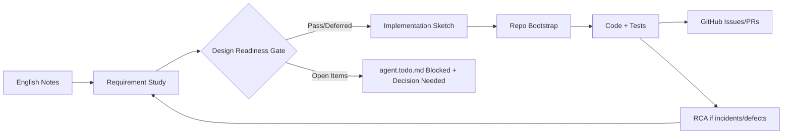

# polyagent-skills

**Write AI agent skills once, use everywhere — portable skill library for Claude Code, Kiro, Codex, Gemini, OpenClaw, Cursor & more.**

[](LICENSE)

---

## The Problem

Every AI coding agent has its own way of consuming instructions — `CLAUDE.md`, `AGENTS.md`, `.kiro/specs/`, `.cursor/rules.md`. Writing skills for one means rewriting for another. That's unsustainable when you're switching agents across machines, teams, or tasks.

## The Solution

**polyagent-skills** is a spec-driven, agent-agnostic skill library. Skills are written once in portable Markdown and consumed by any agent through thin adapter files.

```
┌──────────────────────────────────────────────────┐
│  Layer 3: Adapters        (thin, per-agent)       │
│  CLAUDE.md / AGENTS.md / .kiro/ / .gemini/        │
├──────────────────────────────────────────────────┤
│  Layer 2: Skill Library   (portable, markdown)    │
│  skills/requirement-study/  skills/deck-creator/  │
├──────────────────────────────────────────────────┤
│  Layer 1: Common Foundation (shared patterns)     │
│  common-skills/  templates/  conventions          │
└──────────────────────────────────────────────────┘
```

## Supported Agents

| Agent | Adapter File | Status | Notes |
|-------|-------------|--------|-------|
| Claude Code | `~/.claude/CLAUDE.md` | ✅ Supported | Reads filesystem directly; no extra step needed |
| OpenAI Codex | `~/.codex/AGENTS.md` | ✅ Supported | |
| AWS Kiro | `~/.kiro/specs/polyagent-skills.md` | ✅ Supported | |
| Google Gemini Code Assist | `.gemini/instructions.md` | ✅ Supported | IDE integration; may need project-local install |
| Google Gemini CLI | `~/.gemini/instructions.md` + native registry | ✅ Supported | Requires `gemini skills link` — handled automatically by `install-global` |
| OpenClaw | `~/.openclaw/skills/` | ✅ Supported | |
| Cursor | `.cursor/rules.md` | ✅ Supported | |
| Windsurf | `.windsurfrules` | 🟡 Planned | |

## Quick Start

```bash
# Clone the repo
git clone https://github.com/gyanranjan/polyagent-skills.git
cd polyagent-skills

# Check prerequisites (and optionally install missing tools)
python3 scripts/polyagentctl.py doctor --fix

# One-time global install (Claude Code + Codex + Kiro + Gemini + OpenClaw)
python3 scripts/polyagentctl.py install-global copy

# `install-global` also installs ~/.local/bin/polyagentctl
polyagentctl doctor   # now available globally

# (Optional) explicit reinstall to PATH
python3 scripts/polyagentctl.py self-install

# Project install
polyagentctl install-project /path/to/my-project all
polyagentctl install-project /path/to/my-project claude-code
```

Use global install when you want "set once, reuse everywhere." Use project install when you want repo-local agent config files.

## Spec-Driven Delivery Flow



Key controls before coding:
- Requirements traced as `REQ-*` / `NFR-*`
- Architecture pattern, language/runtime, DB strategy, and logging baseline decided
- Open design items explicitly blocked in `agent.todo.md`

## Install Modes

### Global (one-time)

```bash
polyagentctl install-global copy
```

This installs:

- Shared global library: `~/.polyagent-skills/skills` and `~/.polyagent-skills/common-skills`
- Global Claude Code instructions: `~/.claude/CLAUDE.md`
- Global Codex instructions: `~/.codex/AGENTS.md`
- Global Kiro instructions: `~/.kiro/specs/polyagent-skills.md`
- Global Gemini instructions: `~/.gemini/instructions.md`
- OpenClaw managed skills: `~/.openclaw/skills` and `~/.openclaw/common-skills`

Optional dev mode (symlinks shared library for live edits):

```bash
polyagentctl install-global link
```

### Uninstall global setup (safe)

```bash
# Preview what would be removed
polyagentctl uninstall-global --dry-run

# Remove only installer-managed paths
polyagentctl uninstall-global
```

Uninstall removes only paths recorded in installer manifest files and only when ownership markers match.

### Per-project

```bash
polyagentctl install-project /path/to/my-project all
```

This copies adapters plus `skills/` and `common-skills/` into that specific project.

## Available Skills

| Skill | Purpose | Status |
|-------|---------|--------|
| [idea-to-mvp](skills/idea-to-mvp/) | Turn a rough idea into a validated MVP plan | ✅ Active |
| [requirement-study](skills/requirement-study/) | Analyze, write, and validate requirements | ✅ Active |
| [implementation-sketch](skills/implementation-sketch/) | Create implementation plans from specs | ✅ Active |
| [mail-summarizer](skills/mail-summarizer/) | Summarize and draft replies to emails | ✅ Active |
| [document-analyzer](skills/document-analyzer/) | Understand and extract insights from documents | ✅ Active |
| [deck-creator](skills/deck-creator/) | Create presentations from content | ✅ Active |
| [repo-bootstrap](skills/repo-bootstrap/) | Scaffold new repositories with best practices | ✅ Active |
| [agent-writer](skills/agent-writer/) | Write new agent definitions | ✅ Active |
| [desensitizer](skills/desensitizer/) | Data desensitization and anonymization | ✅ Active |
| [remote-ops](skills/remote-ops/) | Remote operations and infra management | ✅ Active |
| [expert-research](skills/expert-research/) | Deep expert analysis and recommendation support | ✅ Active |
| [context-orchestrator](skills/context-orchestrator/) | Build reusable project context packs and session handoffs | ✅ Active |
| [automation-architect](skills/automation-architect/) | Design automation pipelines, CI/CD systems, and workflow automation | ✅ Active |
| [business-strategist](skills/business-strategist/) | Market positioning, business model design, and competitive strategy | ✅ Active |
| [customer-advocate](skills/customer-advocate/) | Deep user empathy and voice-of-customer for product decisions | ✅ Active |
| [devils-advocate](skills/devils-advocate/) | Stress-test decisions and plans by arguing the opposing case | ✅ Active |
| [engineering-team](skills/engineering-team/) | Translate specs into engineering tasks, plans, and code scaffolds | ✅ Active |
| [entrepreneur](skills/entrepreneur/) | Opportunity-first thinking, value propositions, and business outcomes | ✅ Active |
| [growth-engineer](skills/growth-engineer/) | Acquisition, activation, retention, and referral growth systems | ✅ Active |
| [historian-knowledge-curator](skills/historian-knowledge-curator/) | Organizational memory, decisions, and learnings capture | ✅ Active |
| [ideator](skills/ideator/) | Divergent idea generation and creative lateral thinking | ✅ Active |
| [operations-commander](skills/operations-commander/) | Production readiness, deployment, runbooks, and incident response | ✅ Active |
| [poc-spike](skills/poc-spike/) | Proof-of-concept spikes to de-risk technical unknowns | ✅ Active |
| [product-manager](skills/product-manager/) | Product spec, feature prioritization, and outcome-driven decisions | ✅ Active |
| [qa-validator](skills/qa-validator/) | Test strategies, acceptance criteria, and pre-delivery validation | ✅ Active |
| [research-analyst](skills/research-analyst/) | Deep research, evidence synthesis, and confidence-aware findings | ✅ Active |
| [role-orchestrator](skills/role-orchestrator/) | Classify tasks, select roles, manage handoffs across multi-agent workflows | ✅ Active |
| [security-guardian](skills/security-guardian/) | Threat modeling, vulnerability review, and secure design validation | ✅ Active |
| [subject-matter-expert](skills/subject-matter-expert/) | Parameterizable deep domain expert (e.g. SME Kubernetes, SME Finance) | ✅ Active |
| [systems-architect](skills/systems-architect/) | Scalable system design, architecture decisions, and trade-off analysis | ✅ Active |
| [systems-simplifier](skills/systems-simplifier/) | Identify and eliminate unnecessary complexity and over-engineering | ✅ Active |
| [visionary-futurist](skills/visionary-futurist/) | Long-horizon technology trajectories and second-order consequences | ✅ Active |

## Repo Structure

```
polyagent-skills/
├── README.md
├── LICENSE
├── CONTRIBUTING.md
├── KNOWN_ISSUES.md
├── agent.todo.md             # Canonical cross-session, multi-agent TODO ledger
│
├── docs/
│   ├── specs/                 # Spec-driven development
│   │   ├── SPEC_TEMPLATE.md
│   │   ├── skill-format-spec.md
│   │   └── adapter-contract-spec.md
│   ├── adrs/                  # Architecture Decision Records
│   │   ├── ADR_TEMPLATE.md
│   │   ├── 001-markdown-as-skill-format.md
│   │   ├── 002-three-layer-architecture.md
│   │   ├── 003-adapter-pattern.md
│   │   ├── 004-mcp-for-tool-skills.md
│   │   ├── 005-workflow-orchestration-and-session-todo.md
│   │   └── 006-gated-development-lifecycle.md
│   ├── rca/                   # Root Cause Analysis templates and docs
│   │   └── RCA_TEMPLATE.md
│   └── rfcs/                  # Proposals for significant changes
│       └── RFC_TEMPLATE.md
│
├── common-skills/             # Shared building blocks
│   ├── README.md
│   ├── agent-todo-ledger.md
│   ├── design-readiness-gate.md
│   ├── document-tail-sections.md
│   ├── output-formatting.md
│   ├── quality-checklist.md
│   └── mermaid-to-pdf.md
│
├── skills/                    # Portable skill library
│   ├── idea-to-mvp/
│   ├── requirement-study/
│   ├── implementation-sketch/
│   ├── poc-spike/
│   ├── mail-summarizer/
│   ├── document-analyzer/
│   ├── deck-creator/
│   ├── repo-bootstrap/
│   ├── agent-writer/
│   ├── desensitizer/
│   ├── remote-ops/
│   ├── expert-research/
│   ├── context-orchestrator/
│   ├── automation-architect/
│   ├── business-strategist/
│   ├── customer-advocate/
│   ├── devils-advocate/
│   ├── engineering-team/
│   ├── entrepreneur/
│   ├── growth-engineer/
│   ├── historian-knowledge-curator/
│   ├── ideator/
│   ├── operations-commander/
│   ├── product-manager/
│   ├── qa-validator/
│   ├── research-analyst/
│   ├── role-orchestrator/
│   ├── security-guardian/
│   ├── subject-matter-expert/
│   ├── systems-architect/
│   ├── systems-simplifier/
│   └── visionary-futurist/
│
├── adapters/                  # Thin agent-specific wrappers
│   ├── claude-code/
│   ├── codex/
│   ├── kiro/
│   ├── gemini/
│   └── cursor/
│
├── mcp-servers/               # MCP servers for tool-based skills
│
├── templates/                 # Reusable document templates
│   ├── decision-record.md
│   ├── handoff-note.md
│   ├── research-request.md
│   └── role-status.md
│
├── tests/                     # Test suite
│   └── test_polyagentctl.py
│
├── projects/                  # Example and reference projects
│   └── example-project/
│
├── scripts/                   # Automation (single entry point)
│   └── polyagentctl.py        # Unified CLI — all operations, no shell deps
│
├── agent-notes/               # Cross-cutting agent observations
│
└── .github/
    ├── ISSUE_TEMPLATE/
    └── workflows/
```

## Design Principles

1. **Skills are knowledge, not code** — Written in Markdown, readable by any LLM
2. **Adapters are thin** — Never put skill logic in an adapter; only pointers
3. **Spec-driven** — Every skill follows the [Skill Format Spec](docs/specs/skill-format-spec.md)
4. **Decisions are recorded** — All architecture choices have an [ADR](docs/adrs/)
5. **Common patterns are shared** — DRY via `common-skills/`
6. **MCP for tools** — When skills need capabilities (not just instructions), use MCP

## Documentation

- [Skill Format Spec](docs/specs/skill-format-spec.md) — How to write a portable skill
- [Adapter Contract Spec](docs/specs/adapter-contract-spec.md) — How adapters work
- [Architecture Decision Records](docs/adrs/) — Why we made the choices we did
- [RCA Template](docs/rca/RCA_TEMPLATE.md) — Root cause analysis format for incidents/defects
- [Known Issues](KNOWN_ISSUES.md) — Current limitations and workarounds
- [Contributing Guide](CONTRIBUTING.md) — How to add skills and adapters

## Workflow Automation (`polyagentctl`)

All operations are available through a single Python CLI — no shell required.

```bash
# Check prerequisites; --fix to install missing optional tools interactively
polyagentctl doctor [--fix]

# Validate design readiness sections (strict: fails on Open)
polyagentctl design-check path/to/requirements.md path/to/spec.md

# Structure-only validation (allows Open)
polyagentctl design-check --allow-open path/to/spec.md

# Check lifecycle gate status
polyagentctl gate-check [agent.todo.md]

# Sync requirement/spec traceability into agent.todo.md
polyagentctl sync-todo agent.todo.md path/to/requirements.md [path/to/spec.md]

# Create GitHub issue stubs from REQ IDs
polyagentctl init-issues path/to/requirements.md org/repo

# Convert Markdown with Mermaid diagrams to PDF (falls back to HTML when no PDF tool available)
polyagentctl export-pdf path/to/document.md

# Verify context pack structure and traceability
polyagentctl verify-context-pack context/pack.md

# Regenerate skill lists in all adapter files
polyagentctl sync-adapters

# Pull a skill from skills.sh
polyagentctl pull-skill <skill-name-or-url>

# Pre-PR quality gate
polyagentctl check --strict --project .
```

## Verifying Skills Per Agent

After installing, use these checks to confirm each agent can see the skill library.

### Claude Code

Claude Code reads the filesystem directly using its tools. Ask it:

> "What skills do you have available?"

It should read `~/.claude/CLAUDE.md` and list the skills directory. No extra step needed.

### Gemini CLI (`gemini`)

Gemini CLI has **two layers** — a system prompt and a native skill registry. Both must be populated:

```bash
# Check what's registered in the native skill registry
gemini skills list

# Should show all 32 skills as [Enabled]. If not, re-run install:
polyagentctl install-global link
```

Inside a `gemini` session, ask:

> "What skills do you have available?"

It should list all Active Skills including `idea-to-mvp`, `requirement-study`, etc.

If you see only `skill-creator [Built-in]`, the native registry wasn't populated. Re-run `polyagentctl install-global`.

### Gemini Code Assist (IDE)

Check that `.gemini/instructions.md` exists in your project:

```bash
polyagentctl install-project . gemini
cat .gemini/instructions.md
```

Then in the IDE chat ask: `"What skills do you have?"`. See [KI-003](KNOWN_ISSUES.md) if it doesn't respond to skills.

### OpenAI Codex

Check `~/.codex/AGENTS.md` exists and lists skills. Inside Codex, ask:

> "List your available skills."

### AWS Kiro

Check `~/.kiro/specs/polyagent-skills.md` exists. In a Kiro session, ask:

> "What skills are available to you?"

See [KI-001](KNOWN_ISSUES.md) if Kiro loses context following multi-file reference chains.

### Quick health check (all agents)

```bash
polyagentctl doctor           # checks prerequisites
polyagentctl check --strict --project .   # validates project setup
gemini skills list            # Gemini CLI specific
```

---

## License

MIT — see [LICENSE](LICENSE)
