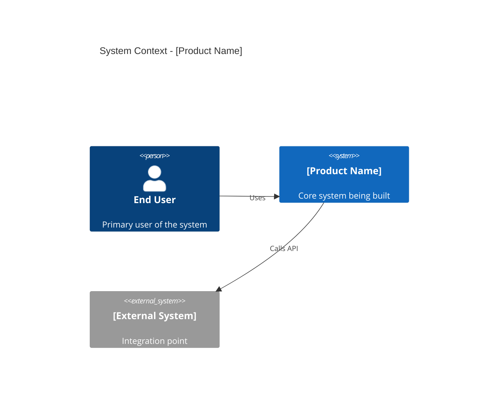
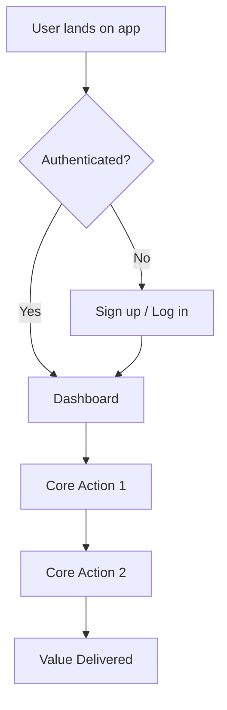
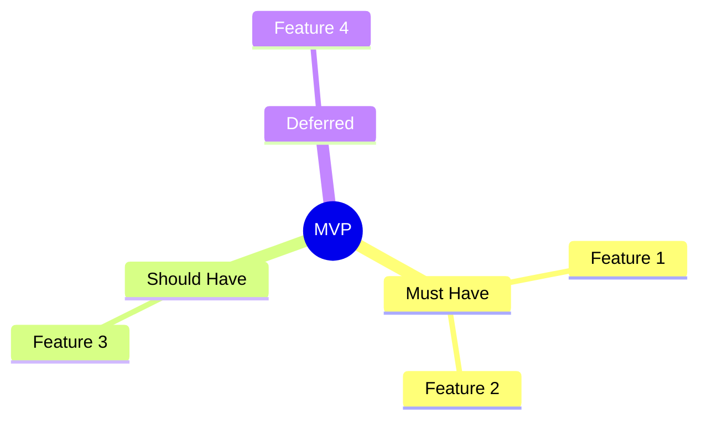

# Idea to MVP

## Purpose

Transform a rough, informal idea (even a single paragraph) into a validated requirement document and actionable MVP plan. The agent acts as a domain-expert product manager — actively asking questions, confirming understanding, identifying skill gaps, researching the competitive landscape, and ultimately delivering a structured spec with mermaid diagrams ready for implementation handoff.

## When to Use

- User provides a short idea or concept and wants to explore it
- User says "I have an idea", "help me figure out what to build"
- User wants to go from zero to a structured MVP plan
- User asks "what would the MVP look like for X?"
- User provides rough notes and wants a product manager perspective

## When NOT to Use

- User already has formal requirements (use `requirement-study` instead)
- User has requirements and wants implementation tasks (use `implementation-sketch`)
- User wants to present an existing plan (use `deck-creator`)
- User wants to write code immediately (that's coding, not discovery)

## Inputs

**Required:**
- Raw idea — a few lines of text describing what the user wants to build

**Optional:**
- Project name — if not provided, the agent will suggest one
- Target audience or market context
- Known technical constraints or preferences
- Budget or timeline context
- Existing competitors the user is already aware of

## Process

### Step 1: Preflight Tooling Check

Run non-blocking checks for tools needed later:

```bash
# Mermaid CLI for diagram rendering
if command -v mmdc >/dev/null 2>&1; then
  mmdc --version
else
  echo "mmdc not installed; diagrams will be inline Mermaid codeblocks"
fi

# PDF generation tooling (for final export)
if command -v pandoc >/dev/null 2>&1; then
  echo "pandoc available"
else
  echo "pandoc not installed; PDF export will need manual conversion"
fi
```

If tools are missing, note in `agent.todo.md` under `Next` but do not block.

### Step 2: Capture and Summarize the Idea

Read the user's raw input carefully. Produce a **3-5 sentence summary** that distills:
- **What** they want to build (the core product/feature)
- **Who** it is for (target users/audience)
- **Why** it matters (the problem being solved or value created)

Present this summary to the user with the explicit question:

> "Here is my understanding of your idea: [summary]. Is this accurate, or would you like to adjust anything?"

**Do NOT proceed until the user confirms the summary is correct.** If they correct or add details, revise and re-confirm.

### Step 3: Suggest Project Name and Create Project Directory

Once the idea summary is confirmed, propose a project name:

1. **If the user already provided a name**, confirm it and use it.
2. **If no name was given**, suggest 2-3 names based on the idea:
   - Use `kebab-case` (e.g., `smart-invoice`, `health-tracker`, `team-pulse`)
   - Keep names short (1-3 words), memorable, and relevant to the domain
   - Avoid generic names like `my-app`, `project-1`

Present the options:

> "I'd suggest these project names: **smart-invoice**, **bill-flow**, **invoice-ai**. Which do you prefer, or do you have your own name in mind?"

Once a name is confirmed, create the project directory structure:

```bash
# Create project root and docs directory
mkdir -p <project-name>/docs

# The MVP document will be written here later
# <project-name>/docs/idea-to-mvp-<topic>.md
# <project-name>/docs/competitor-analysis.md
```

If the user specifies a different location for the project directory (e.g., a specific parent path), use that instead of the current working directory.

The project directory serves as the home for all artifacts this skill produces. If the directory already exists, confirm with the user before writing into it.

### Step 4: Domain Expert Deep-Dive (Product Manager Mode)

Act as a seasoned product manager in the relevant domain. Ask the user **up to 5 focused questions** to uncover:

1. **Target users** — Who specifically will use this? (personas, roles, demographics)
2. **Core problem** — What pain point or need does this address? What are users doing today without this?
3. **Key differentiator** — What makes this different from existing solutions?
4. **Success metrics** — How will you know this is working? (usage, revenue, engagement, etc.)
5. **Constraints** — Any hard limits on technology, budget, timeline, regulations?

Present all questions at once. After the user responds, summarize the enriched understanding and confirm again:

> "Based on your answers, here is the refined picture: [enriched summary]. Does this capture everything?"

### Step 5: Identify Required Skills, Technologies, and Domains

Based on the confirmed understanding, produce a structured assessment:

#### Skills and Expertise Needed

| Category | Specific Skills | Priority (Must/Should/Nice) |
|----------|----------------|-----------------------------|
| Engineering | [e.g., Backend API, Mobile dev, ML/AI] | Must Have |
| Design | [e.g., UX research, UI design] | Must Have |
| Domain | [e.g., Healthcare compliance, Fintech regulations] | Must Have |
| Operations | [e.g., DevOps, Data engineering] | Should Have |

#### Technology Stack Recommendations

| Layer | Recommended Options | Rationale |
|-------|-------------------|-----------|
| Frontend | [options] | [why] |
| Backend | [options] | [why] |
| Database | [options] | [why] |
| Infrastructure | [options] | [why] |
| Third-party APIs | [options] | [why] |

Present this to the user and ask:

> "Do these technology and skill recommendations align with your team's capabilities? Any preferences or constraints I should factor in?"

### Step 6: Competitor and Landscape Research

Identify the competitive landscape using available information:

1. **Ask the user** about known competitors:
   > "Are there any existing products or competitors you're already aware of? This helps me map the landscape."

2. **Research using available tools** — use web search if available, or draw on domain knowledge to identify:
   - Direct competitors (solve the same problem for the same audience)
   - Indirect competitors (solve adjacent problems or serve different segments)
   - Alternatives (non-product solutions: manual processes, spreadsheets, etc.)

3. **Produce a competitor matrix**:

```markdown
## Competitive Landscape

| Competitor | Type | Target Audience | Key Features | Pricing Model | Key Weakness |
|------------|------|-----------------|--------------|---------------|--------------|
| [name] | Direct | [who] | [what they do] | [free/paid/freemium] | [gap your product fills] |

### Your Differentiation
[2-3 sentences on how the user's idea is distinct]

### Market Gaps Identified
- [Gap 1 that this product can exploit]
- [Gap 2]
```

Present to the user and ask:

> "Does this competitive picture look right? Any competitors I missed, or is the differentiation accurate?"

### Step 7: Define MVP Scope (MoSCoW)

Based on everything gathered, propose an MVP scope using MoSCoW prioritization:

**Must Have (MVP — launch-blocking):**
- [Feature 1] — [one-line rationale]
- [Feature 2] — [one-line rationale]

**Should Have (fast-follow, weeks after launch):**
- [Feature 3]

**Could Have (v2+, nice to have):**
- [Feature 4]

**Won't Have (explicitly deferred):**
- [Feature 5] — [why it's deferred]

Ask the user:

> "This is the proposed MVP scope. Does the Must Have list feel right for a first launch? Anything to add or remove?"

### Step 8: Produce Architecture and Flow Diagrams

Create mermaid diagrams for:

1. **System context diagram** — shows the product, users, and external systems:



2. **User flow diagram** — the primary happy-path user journey:



3. **MVP feature map** — visual breakdown of what's in/out:



Follow `common-skills/mermaid-to-pdf.md` guidelines to ensure diagrams are PDF-safe:
- Keep labels short (< 40 chars)
- Use simple node shapes
- Limit nodes per diagram to 15
- Avoid special characters in labels

### Step 9: Write the MVP Requirement Document

Assemble the full document following `common-skills/output-formatting.md` and `references/mvp-document-template.md`:

1. **Title and Metadata** (name, date, version, status)
2. **Project Name** (from Step 3)
3. **Idea Summary** (from Step 2, confirmed)
4. **Problem Statement and Value Proposition**
5. **Target Users / Personas**
6. **Competitive Landscape** (from Step 6)
7. **Skills and Technology Assessment** (from Step 5)
8. **MVP Scope** (MoSCoW from Step 7)
9. **Functional Requirements** (REQ-NNN format, MVP items only, with acceptance criteria)
10. **Non-Functional Requirements** (performance, security, scalability baselines)
11. **Architecture Diagrams** (mermaid, from Step 8)
12. **Phased Delivery Plan**
    - Phase 1: MVP (Must Haves)
    - Phase 2: Fast Follow (Should Haves)
    - Phase 3: Growth (Could Haves)
13. **Risks and Open Questions**
14. **Design Readiness Handoff** per `common-skills/design-readiness-gate.md`
15. **Tail sections** per `common-skills/document-tail-sections.md`

Write the document to `<project-name>/docs/idea-to-mvp-<topic>.md`. Filename: `idea-to-mvp-<topic>.md`

### Step 10: Build Design Readiness Handoff

Apply `common-skills/design-readiness-gate.md`:

- Record decisions made during the conversation (tech stack, architecture style, etc.)
- Mark unresolved items as `Deferred` with owner and due date
- Block coding tasks in `agent.todo.md` if required gates are open

### Step 11: Update Cross-Session Ledger

Update `agent.todo.md` using `common-skills/agent-todo-ledger.md`:

- Add MVP tasks to `Now`/`Next`
- Add open questions to `Decision Needed`
- Add competitive research tasks if web search was not available
- Link to GitHub issues if integration is available

### Step 12: Quality Check

Apply `common-skills/quality-checklist.md` plus these skill-specific checks:

- [ ] User confirmed the idea summary before requirements were written
- [ ] Project name was confirmed and directory was created
- [ ] At least one round of PM questions was asked and answered
- [ ] Competitor landscape section exists (even if user-provided only)
- [ ] MVP scope uses MoSCoW with clear rationale for each item
- [ ] Every Must Have feature has REQ-ID, acceptance criteria, and priority
- [ ] Mermaid diagrams follow PDF-safe guidelines from `common-skills/mermaid-to-pdf.md`
- [ ] Architecture and user flow diagrams are present
- [ ] Skills/technology assessment is complete
- [ ] Design readiness gate is addressed

### Step 13: Offer PDF Export

If the user wants the document as a PDF, follow `common-skills/mermaid-to-pdf.md` to produce a clean PDF with rendered diagrams. If tooling is unavailable, note in `agent.todo.md` and provide the Markdown document with inline mermaid codeblocks.

## Output Format

A project directory named `<project-name>/` containing:
- `docs/idea-to-mvp-<topic>.md` — the full MVP requirement document (structure from Step 9)
- `docs/competitor-analysis.md` — detailed competitor research (if performed)

Optionally, a PDF export with rendered mermaid diagrams (via `scripts/md-to-pdf.sh` or manual steps from `common-skills/mermaid-to-pdf.md`).

## Quality Checks

- [ ] User's idea was summarized and confirmed before any specification work
- [ ] Project name was suggested (or user-provided) and project directory created
- [ ] Product manager questions were asked; user responses incorporated
- [ ] Competitive landscape was researched or user-provided
- [ ] MVP scope is explicit with MoSCoW priorities
- [ ] Requirements have IDs, acceptance criteria, and traceable rationale
- [ ] Mermaid diagrams are present and PDF-safe
- [ ] Skills and technology assessment is actionable
- [ ] Design readiness handoff exists or is explicitly deferred in `agent.todo.md`

## Common Skills Used

- `common-skills/agent-todo-ledger.md` — Cross-session task tracking
- `common-skills/design-readiness-gate.md` — Pre-coding architecture decision gate
- `common-skills/document-tail-sections.md` — Standard document endings
- `common-skills/output-formatting.md` — Consistent formatting
- `common-skills/quality-checklist.md` — Pre-delivery quality gate
- `common-skills/mermaid-to-pdf.md` — Reliable mermaid diagram rendering for PDF export

## Edge Cases

- **Extremely vague input** ("I want to build something cool"): Expand Step 2 into an open-ended discovery conversation — ask about the user's interests, skills, problems they face daily, and audience before attempting a summary
- **User already knows competitors well:** Skip web research in Step 5, use user-provided list, and focus on differentiation analysis
- **No web search available for competitor research:** Rely on the user and agent domain knowledge; explicitly note "competitor research limited to known information" in the document
- **User wants to jump straight to coding:** Recommend completing at least Steps 2-6 first; offer a "speed run" mode that produces a minimal MVP scope doc in one pass without the full interactive loop
- **Regulated domain (healthcare, fintech, etc.):** Add a regulatory requirements section between NFRs and Architecture; flag compliance needs early in Step 3
- **Team of one / solo founder:** Adjust technology recommendations toward managed services and low-ops solutions; flag skills gaps as hiring or outsourcing needs
- **Project directory already exists:** Ask the user before writing into it — they may want a subdirectory or a different name to avoid overwriting existing work
- **User provides a project name upfront:** Skip the naming suggestions in Step 3 and use their name directly
