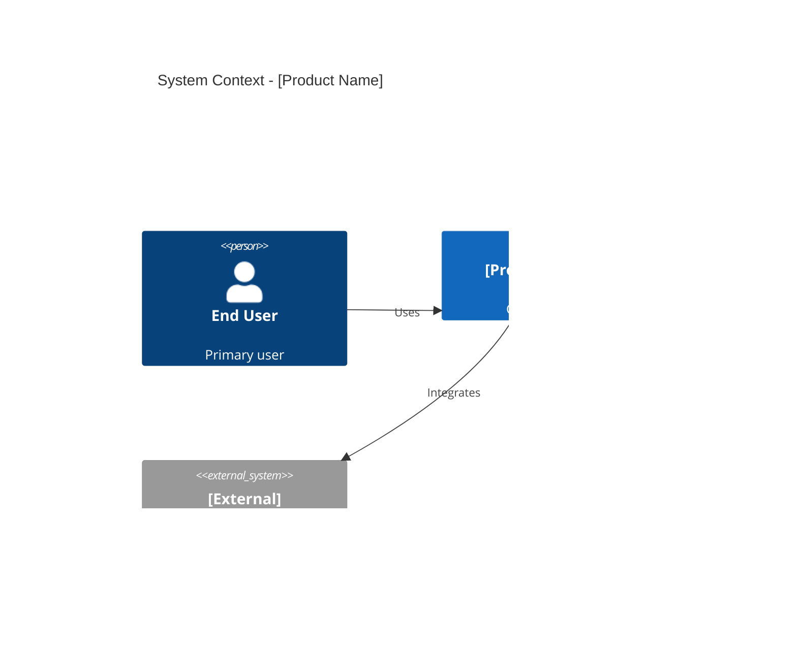
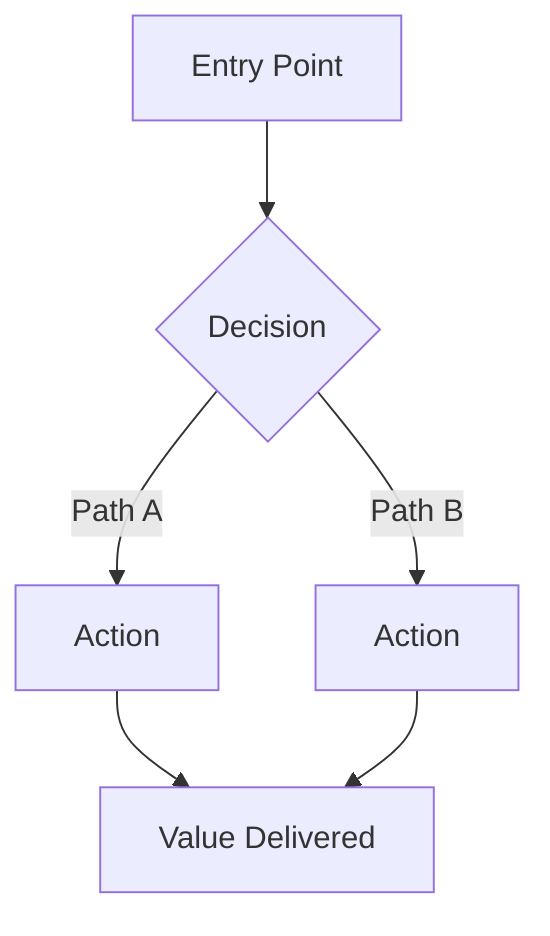
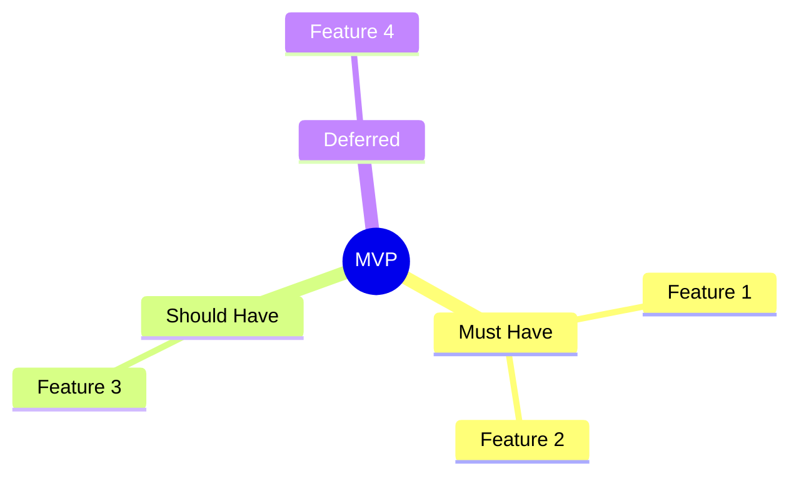

# MVP Document Template

Use this template when producing the final idea-to-MVP document.

---

# MVP Plan: [Product/Feature Name]

**Author:** [agent + human reviewer]
**Date:** YYYY-MM-DD
**Version:** 1.0
**Status:** Draft | In Review | Approved
**Project Name:** [kebab-case-project-name]
**Project Directory:** `<project-name>/`
**Canonical TODO Ledger:** `agent.todo.md`
**GitHub Project/Repo:** [org/repo]

---

## Idea Summary

[3-5 sentence summary of the original idea, confirmed by the user]

## Problem Statement

**The Problem:** [What pain point or gap exists today]

**Who Feels It:** [Target users/audience]

**Current Alternatives:** [How people solve this today without the product]

**Value Proposition:** [Why this solution is better — one clear sentence]

## Target Users / Personas

| Persona | Role / Description | Primary Need | Usage Frequency |
|---------|--------------------|--------------|-----------------|
| [Name] | [Who they are] | [What they need] | Daily / Weekly / Monthly |

## Competitive Landscape

| Competitor | Type | Target Audience | Key Features | Pricing Model | Key Weakness |
|------------|------|-----------------|--------------|---------------|--------------|
| [name] | Direct/Indirect | [who] | [what they do] | [model] | [gap] |

### Differentiation

[2-3 sentences on how this product stands apart]

### Market Gaps

- [Gap 1]
- [Gap 2]

## Skills and Technology Assessment

### Required Skills

| Category | Specific Skills | Priority (Must/Should/Nice) |
|----------|----------------|-----------------------------|
| Engineering | [skills] | Must Have |
| Design | [skills] | Must Have |
| Domain | [skills] | Must Have |

### Technology Stack

| Layer | Recommendation | Rationale |
|-------|---------------|-----------|
| Frontend | [tech] | [why] |
| Backend | [tech] | [why] |
| Database | [tech] | [why] |
| Infrastructure | [tech] | [why] |

## MVP Scope (MoSCoW)

### Must Have (MVP — launch-blocking)

**[REQ-001]** Functional
**Title:** [Short title]
**Description:** [Clear, unambiguous statement]
**Rationale:** [Why this is launch-blocking]
**Priority:** Must Have
**Acceptance Criteria:**
- [Testable condition 1]
- [Testable condition 2]
**Dependencies:** [REQ-XXX] if any
**Source:** [Step/conversation reference]

### Should Have (fast-follow)

**[REQ-NNN]** ...

### Could Have (v2+)

- [Feature] — [brief rationale for deferral]

### Won't Have (explicitly excluded)

- [Feature] — [why it's out]

## Non-Functional Requirements

**[NFR-001]**
**Title:** [e.g., Response Time]
**Description:** [e.g., API responses < 200ms at p95]
**Measurable Criteria:** [specific metric]
**Priority:** Must Have

## Architecture Overview

### System Context

### User Flow

### MVP Feature Map

## Phased Delivery Plan

### Phase 1: MVP (Must Haves)

- [ ] Task 1.1: [Description] — Est: [S/M/L] — Depends on: -
- [ ] Task 1.2: [Description] — Est: [S/M/L] — Depends on: 1.1

### Phase 2: Fast Follow (Should Haves)

- [ ] Task 2.1: [Description] — Est: [S/M/L] — Depends on: Phase 1

### Phase 3: Growth (Could Haves)

- [ ] Task 3.1: [Description] — Est: [S/M/L] — Depends on: Phase 2

## Risks and Open Questions

| # | Risk / Question | Severity | Owner | Mitigation / Due Date | Status |
|---|-----------------|----------|-------|-----------------------|--------|
| 1 | [risk] | High/Med/Low | [who] | [what to do] | Open |

## Design Readiness Handoff (Pre-Coding)

| Checkpoint | Status (Done/Deferred/Open) | Owner | Evidence/Link |
|------------|------------------------------|-------|---------------|
| Architecture pattern | Open | | |
| Language/runtime choice | Open | | |
| Database strategy | Open | | |
| Logging/observability baseline | Open | | |

Coding start rule:
- Do not start implementation until required checkpoints are `Done` or explicitly `Deferred` with owner and due date.

## Multi-Agent Coordination

| Artifact | Current Owner Agent | Lock Status | Handoff Needed |
|----------|---------------------|-------------|----------------|
| [path] | [agent] | Locked/Free | Yes/No |

## Revision History

| Version | Date | Author | Changes |
|---------|------|--------|---------|
| 1.0 | YYYY-MM-DD | | Initial version |

## Assumptions & Constraints

- [Assumption 1]
- [Constraint 1]

## Open Questions

| # | Question | Owner | Due Date | Status |
|---|----------|-------|----------|--------|
| 1 | | | | Open |

## References

- [Source material or related documents]

## Glossary

| Term | Definition |
|------|-----------|
| [term] | [definition] |
