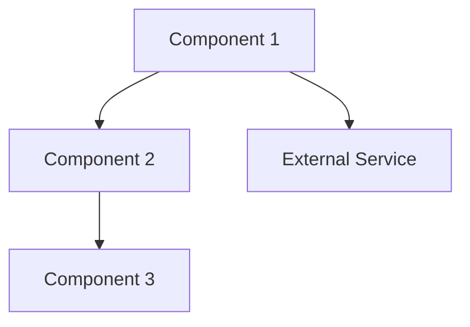
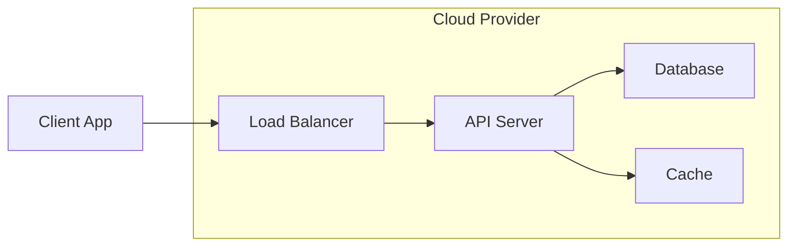
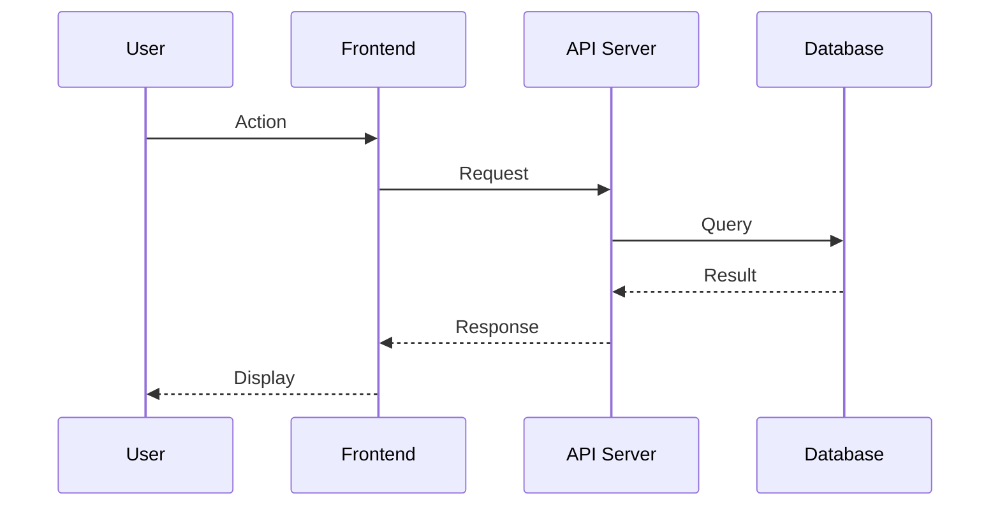

# Software Requirement Specification: <Project Name>

**Date:** YYYY-MM-DD
**Version:** 1.0
**Status:** Draft
**Role:** Systems Architect

---

## Executive Summary

<2-3 sentence overview of the system architecture>

---

## System Architecture

### Design Goals (Ranked)

1. <goal 1> — <rationale>
2. <goal 2> — <rationale>
3. <goal 3> — <rationale>

### Constraints

| Constraint | Source | Impact |
|-----------|--------|--------|
| <constraint> | Technical / Business / Regulatory | <how it shapes the design> |

---

## Major Components

| Component | Responsibility | Technology | Inputs | Outputs | Dependencies |
|-----------|---------------|------------|--------|---------|-------------|
| <component> | <single responsibility> | <tech choice> | <what it receives> | <what it produces> | <other components> |

### Component Details

#### <Component 1 Name>

**Responsibility:** <what it does>
**Technology:** <chosen technology with rationale>
**Key Design Notes:** <important implementation considerations>

#### <Component 2 Name>

<Same structure>

---

## Architecture Diagram

<Text description of what the diagram shows>

<Additional diagrams as appropriate: sequence, state, data flow>

---

## Interfaces

### API Contracts (Sketch Level)

| Endpoint | Method | Purpose | Request | Response |
|----------|--------|---------|---------|----------|
| <path> | GET/POST/PUT/DELETE | <what it does> | <key fields> | <key fields> |

### Data Models

| Entity | Key Fields | Relationships | Storage |
|--------|-----------|---------------|---------|
| <entity> | <fields> | <relations> | <where stored> |

### Event Contracts (If Event-Driven)

| Event | Producer | Consumer | Payload |
|-------|----------|----------|---------|
| <event> | <component> | <component> | <key fields> |

---

## Deployment Topology

### Environment Layout

| Environment | Purpose | Infrastructure | Notes |
|-------------|---------|---------------|-------|
| Development | Local dev and testing | <infra> | <notes> |
| Staging | Pre-production validation | <infra> | <notes> |
| Production | Live system | <infra> | <notes> |

### Deployment Diagram

---

## Data Flow

### Primary User Flow

<Description of how data moves through the system for the primary use case>

---

## Scalability Assumptions

| Dimension | Current Target | 10x Target | Bottleneck | Strategy |
|-----------|---------------|-----------|------------|----------|
| Users | <count> | <count> | <what breaks first> | <how to scale> |
| Requests/sec | <count> | <count> | <what breaks first> | <how to scale> |
| Data volume | <size> | <size> | <what breaks first> | <how to scale> |

---

## Technology Choices

| Layer | Choice | Alternatives Considered | Rationale |
|-------|--------|------------------------|-----------|
| Frontend | <choice> | <alternatives> | <why this one> |
| Backend | <choice> | <alternatives> | <why this one> |
| Database | <choice> | <alternatives> | <why this one> |
| Infrastructure | <choice> | <alternatives> | <why this one> |
| Third-Party | <choice> | <alternatives> | <why this one> |

---

## Failure Modes and Mitigations

| Failure | Impact | Likelihood | Mitigation |
|---------|--------|-----------|------------|
| <failure mode> | <what happens> | HIGH / MEDIUM / LOW | <how to handle> |

---

## Security Considerations

| Concern | Approach | Priority |
|---------|----------|----------|
| Authentication | <approach> | Must Have |
| Authorization | <approach> | Must Have |
| Data encryption | <approach> | Must / Should Have |
| Input validation | <approach> | Must Have |

---

## Revision History

| Version | Date | Author | Changes |
|---------|------|--------|---------|
| 1.0 | YYYY-MM-DD | Venture Architect | Initial version |

## Assumptions & Constraints

<List assumptions made during analysis>

## Open Questions

<Unresolved questions with suggested owners>

## References

- Feasibility Report: `docs/Feasibility_Report.md`
- BRD: `docs/BRD.md`
- PRD: `docs/PRD.md`
